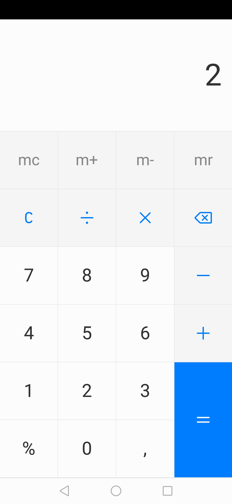

# React Native Calculator App

This is a basic project to learn how to use react native.

Replicating the calculator should be a relative simple task and should not take more than a couple of hours.

Start: 10:42 

# Task One

Run `react-native init djtcalculator --template typescript`

Start: 10:48

# Task Two

Configure release version

Start: 10:55

# Task Three

Install release version to phone

Start 10:56

# Task Four

Configure HOT Reloading with react-native

